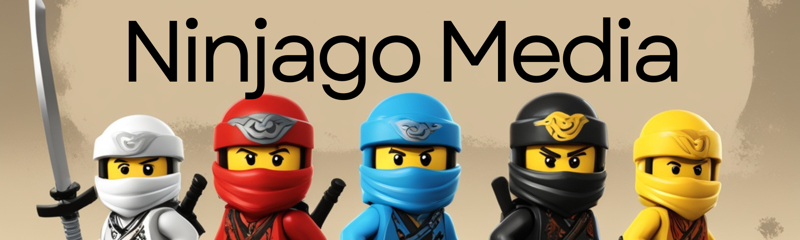
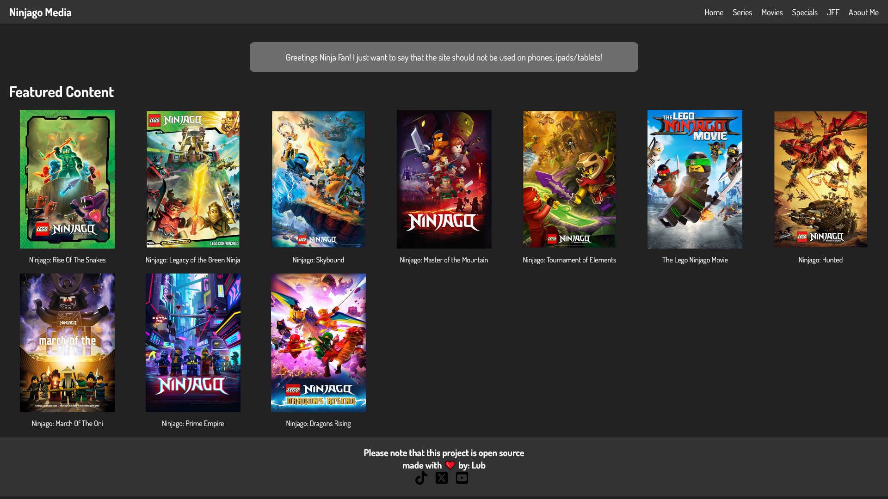
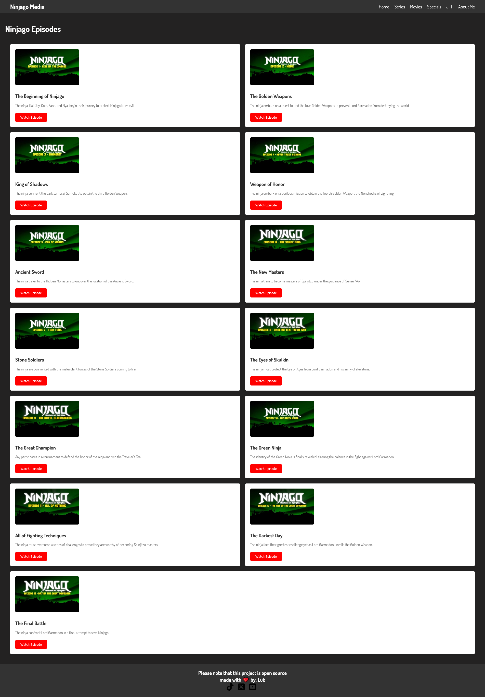
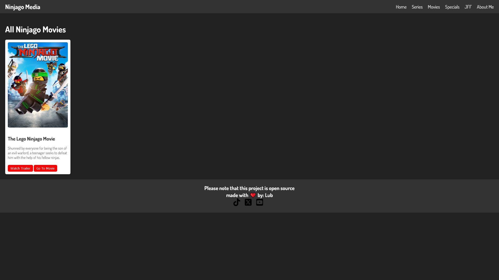

# 🎉 Welcome to Ninjago Media! 🎉

🌟 **Ninjago Media** is your ultimate destination for everything related to the thrilling world of Ninjago! Whether you're a die-hard fan or a newcomer, this site has something for everyone. Dive into the epic adventures, catch up on every season, and relive the best moments from your favorite Ninjago movies and specials. 🌟



## 📖 Table of Contents
- [Read Before Use](#read-before-use)
- [About the Project](#about-the-project)
- [Features](#features)
- [Screenshots](#screenshots)
- [Technologies Used](#technologies-used)
- [Installation](#installation)
- [Usage](#usage)
- [Contributing](#contributing)
- [License](#license)
- [Contact](#contact)

## Read Before Use
Please make sure to read this section carefully before using Ninjago Media. This site is a fan project and not affiliated with the official Ninjago franchise. Enjoy the content respectfully and contribute positively to the community.

## About the Project
Ninjago Media is a fan-made website dedicated to the beloved Ninjago series. Created with love and passion for the Ninjago universe, this platform aims to provide a comprehensive and interactive experience for fans. From detailed episode guides to exclusive movie content, Ninjago Media brings the world of Ninjago to your fingertips.

## Features
- **🖥️ User-Friendly Interface**: Navigate through the site with ease.
- **📺 Series Hub**: Browse and explore all seasons and episodes.
- **🎬 Movie Section**: Discover and watch Ninjago movies.
- **🌟 Specials**: Access exclusive Ninjago specials.
- **❤️ Open Source**: Contribute and be a part of our community.

## Screenshots
### Home Page

### Series Page

### Episode Detail

### Movies Page

### Specials Page
#Soon

## Technologies Used
- **HTML5**: Structure and content.
- **CSS3**: Styling and layout.
- **JavaScript**: Interactive elements and functionality.
- **Google Fonts**: Dosis font for a modern and clean look.

## Installation
To set up Ninjago Media locally, follow these steps:

1. **Clone the repository**:
   ```bash
   git clone https://github.com/vibinlub/ninjago-media.git
   ```
2. **Navigate to the project directory**:
   ```bash
   cd ninjago-media
   ```
3. **Open the `index.html` file in your preferred browser**:
   ```bash
   open index.html
   ```

## Usage
Once you have set up Ninjago Media locally, you can start exploring the content by opening the `index.html` file in your web browser. Navigate through different sections such as the Series Hub, Movie Section, and Specials to enjoy the full Ninjago experience. (if you have issues please message me using discord or mail!)

## Contributing
Contributions are what make the open source community such an amazing place to be learn, inspire, and create. Any contributions you make are **greatly appreciated**.

1. Message me on discord / mail me
2. Add/Make the things you think are needed
3. Message/Mail me again!
4. I will check it
5. Its published 🎉

## License
Distributed under the MIT License. See `LICENSE` for more information.

## Contact
For any questions or inquiries, please contact us at:

- **Email**: LubbertSchenk@hotmail.com
- **Discord**: .lub_
- **GitHub**: [vibinlub](https://github.com/vibinlub)

Thank you for visiting Ninjago Media! Enjoy your stay and feel free to contribute to the project. 🚀
